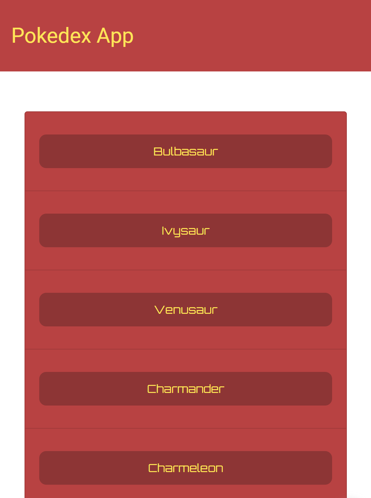

# First_JS_App

My first Javascript Project, wich takes data from an Api and display it on a html page.

Specicly Pokemon names get Displayed in a List and clicking on them opend a Modal, wich Display Additional Detail about that "Pokemon".

Build with

-html,css,javascript
-jqeury +Boostrap
-Pokemon Api https://pokeapi.co/
